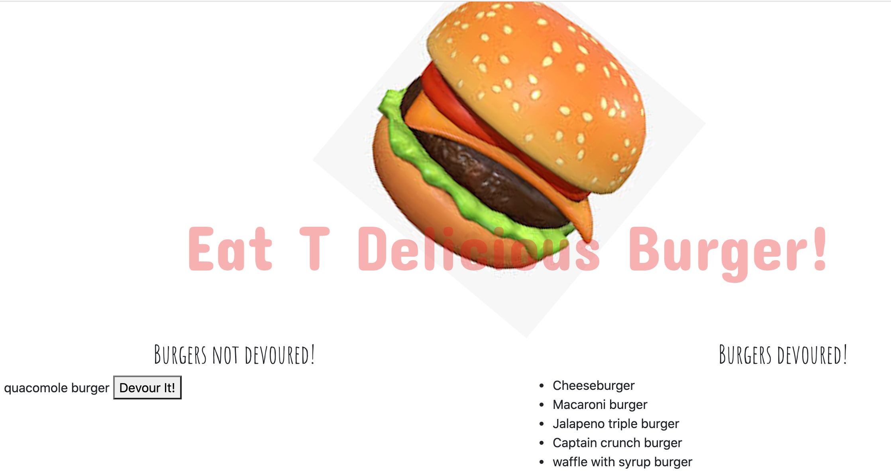

# Burger-Logger 🍔

## Table of contents:
* What:
* How:
* Technologies used:
* Imgs:
* Links: 

## What:
This is a Burger logger restaurant app, deployed using Heroku!

## How:
* This restaurant app, Eat-Da-Burger!, lets users input the names of burgers they'd like to eat. 
* Whenever a user submits a burger's name, the app will display the burger on the left side of the page -- waiting to be devoured.
* Each burger in the waiting area also has a Devour it! button. When the user clicks it, the burger will move to the right side of the page.
* Every burger is stored in a database, whether devoured or not.

## Techologies used:
MySQL, Node, Express, Handlebars and a homemade ORM 🍬

## Imgs:

## Links:

[Link to Github](https://github.com/teresaheidt/Burger-Logger.git)

[Link to Video Demo](https://drive.google.com/file/d/12bTZAOrDmkX-9-ct9BbwNHGBgeav5ZMP/view)